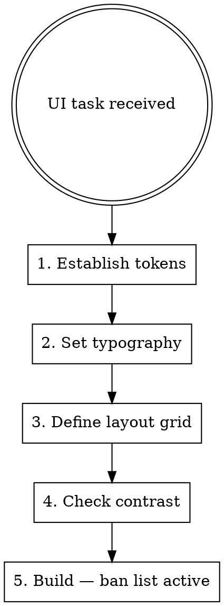

# Anti-AI-Slop UI

## Overview

Left to defaults, AI-generated UI converges on the same aesthetic: near-black backgrounds, indigo/violet accent, glass morphism cards, gradient headlines, ambient radial blobs, and staggered fade-in animations. This is recognizable as machine output and signals low craft. Run the design protocol before any visual decisions.

## The Design Protocol



### Step 1 — Establish Semantic Tokens

Define named roles before hex values. If no brand colors are given, start from white:

```css
:root {
  --color-bg:          #ffffff;      /* page background */
  --color-surface:     #f8f8f7;      /* cards, inputs, subtle panels */
  --color-border:      #e5e5e3;      /* dividers, input borders */
  --color-text:        #1a1a18;      /* primary body copy */
  --color-text-muted:  #6b6b68;      /* secondary labels, metadata */
  --color-accent:      /* derive from brand brief, NOT indigo */;
  --color-accent-fg:   /* text on accent background, must pass AA */;
}
```

**Never choose a color because it "looks modern."** Colors must map to a semantic role.

### Step 2 — Set Typography

Pick one typeface. Use size, weight, and spacing to create hierarchy — not color, gradients, or decoration:

```css
/* Scale: 4 sizes maximum */
--text-xs:   0.75rem  / 1rem;      /* labels, metadata */
--text-sm:   0.875rem / 1.375rem;  /* body, secondary */
--text-base: 1rem     / 1.625rem;  /* primary body */
--text-lg:   1.125rem / 1.5rem;    /* card titles */
--text-xl:   1.5rem   / 1.3;       /* section headings */
--text-2xl:  2.25rem  / 1.15;      /* page headings */
--text-3xl:  3.5rem   / 1.05;      /* hero headings */

/* Weights: 400 (body), 500 (emphasis), 600 (label), 700 (heading) */
```

No gradient text. No shimmer text. Headings are dark on light, period.

### Step 3 — Define Layout Grid

Use an 8px base grid. State the max-width and column count before writing any layout:

```
Max-width:  1200px (marketing) | 1440px (dashboard)
Columns:    12 (desktop) | 4 (mobile)
Gutter:     24px
Margin:     clamp(16px, 5vw, 80px)
```

**Cards are not a layout.** A section with a heading, body copy, and a call to action does not need a box around it. Reserve cards for discrete, scannable data objects (table rows, product items, notification items).

### Step 4 — Verify Contrast

Before finalizing any color pairing:

| Pair | Minimum ratio |
|------|--------------|
| Body text on background | 7:1 (AAA) |
| Large text / headings on background | 4.5:1 (AA) |
| Text on accent background | 4.5:1 (AA) |
| Placeholder / muted text | 4.5:1 (AA) |

Use `--color-text: #1a1a18` on `--color-bg: #ffffff` = 19.5:1. This is the default.

## The Ban List

These patterns are forbidden unless the brand explicitly requires them:

| Banned | Why | Instead |
|--------|-----|---------|
| `backdrop-filter: blur` / glass morphism | Hides content hierarchy | Solid surface with border |
| Gradient headline text | Decorative over semantic | High-weight dark text |
| Near-black backgrounds as default (`#0a0a0f`, `slate-900`) | Forces inverted hierarchy | White or off-white default |
| Indigo/violet/purple as default accent | AI aesthetic fingerprint | Derive from brand brief |
| Radial mesh gradients / ambient blobs | Visual noise, not information | Negative space |
| Spinning / conic-gradient borders | Gimmick, accessibility issue | Solid or 1px border |
| Staggered fade-up entrance animations | Delays usable content | Instant render or single fade |
| Pulsing / shimmer badges | Attention spam | Static badge or none |
| 6-card feature grid | Forces equal visual weight | Varied layout: lead + support |
| 4-up KPI stat card grid | All metrics feel equal | Hierarchy: primary + secondary |
| Noise texture overlays | Decoration as texture | Clean background |
| Trust logo strips with placeholder companies | Fake social proof | Real logos or omit entirely |

## Quick Reference: Before → After

| Slop default | Intentional design |
|---|---|
| `bg-slate-900` everywhere | `bg-white` with ink text |
| `text-indigo-500` accent | Brand token `var(--color-accent)` |
| `backdrop-blur-sm bg-white/10` card | `bg-[--color-surface] border border-[--color-border]` card |
| `bg-gradient-to-r from-indigo-500 to-violet-500` text | `font-bold text-[--color-text]` |
| 6 equal feature cards | 1 hero feature + 3 supporting items |
| `animate-pulse` badge | Static `<span>` label |
| Staggered `transition-delay` reveals | Instant render |
| Radial blob background | White page with intentional whitespace |

## Rationalization Table

| What Claude says | Reality |
|---|---|
| "Dark mode looks more modern" | Light mode is the default; dark mode is a preference. Start light. |
| "Glass morphism adds depth" | It obscures content and signals template UI. Use solid surfaces. |
| "Indigo is a neutral professional color" | It is the AI default accent. Every generated UI uses it. Ask for the brand color. |
| "Animations make it feel premium" | Purposeless animation delays content and reads as filler. |
| "The gradient makes the hero pop" | Gradient text sacrifices readability for decoration. Bold weight pops. |
| "Cards help organize the content" | Cards are data objects. Section content doesn't need a box. |
| "The gradient text uses brand colors, not indigo" | Brand-colored gradient text is still gradient text. The ban is on the technique, not the hue. Bold weight in brand color achieves the same emphasis without the decoration. |
| "The pulsing badge adds urgency / recency signal" | Pulsing is attention spam. Use a static pill label ("Beta", "New", "Live") — the word carries the signal; the pulse is noise. |
| "Staggered animations are within the 150–500ms timing bound" | In-spec timing doesn't make purposeless motion purposeful. Staggered reveals delay content for decoration. One opacity fade on page load maximum; section content renders immediately. |
| "prefers-reduced-motion handles the accessibility concern" | Reduced-motion support is required baseline, not a license to animate freely. The question is not "is it accessible?" but "does this motion serve the user?" Decorative stagger does not. |
| "The gradient button uses semantic brand tokens" | Button gradients are decorative. Solid brand-color fill + contrast-passing text is cleaner and more intentional. |

## Red Flags — Stop and Reset

- Choosing `indigo`, `violet`, or `purple` before seeing a brand brief
- Writing `backdrop-blur` or `glass` anywhere
- Setting a dark background (`slate-900`, `#0a0a`, `bg-gray-950`) as the page default
- Using gradient text on any heading — even with brand colors
- Creating a 6-card or 4-card equal-weight grid as a layout
- Adding staggered `transition-delay` entrance animations to any content section
- Writing `animate-pulse` or `animate-ping` on any badge or status indicator
- Placing a noise, mesh, or blob element in the background
- Reaching for gradient fills on buttons when solid color works
