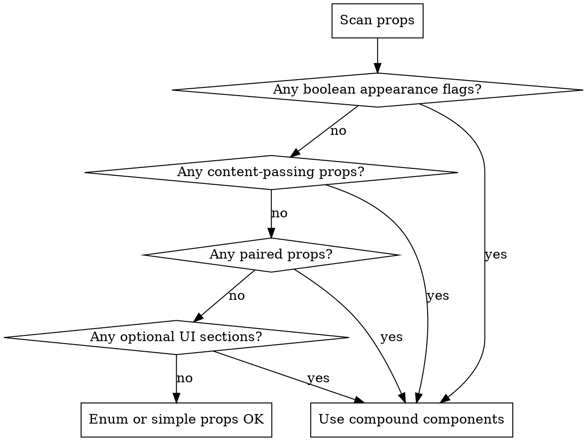

# Compound Component Enforcer

## Overview

Boolean prop hell accumulates silently. Every `isLoading`, `hasFooter`, `leftIcon` added in isolation seems harmless; together they produce APIs that are impossible to use correctly. Run the prop diagnostic before writing any component API — whether creating from scratch or adding a single new feature.

## Diagnostic Protocol (Run Before Writing Any Props)

Scan the spec or existing interface for these patterns:

```
1. Boolean appearance flags    isLoading, isPrimary, isDisabled, isFullScreen
2. Content-passing props       leftIcon, footerContent, headerContent, renderOption
3. Paired props                hasFooter + footerContent, hasAnimation + animationType
4. Optional UI sections        anything that can be absent (header, footer, sidebar, actions)
5. Structural variants         loading state, empty state, error state
```



## The Two Legitimate Prop Types

**Keep as props** (not compound):
- `value` / `onChange` — data, not structure
- `size`, `variant` — enum with a closed set of visual-only options
- `disabled`, `required`, `name` — native HTML semantics

**Convert to compound**:
- Everything else — state flags, content slots, optional sections, structural variants

## Compound Component Pattern

```tsx
// Context — shared state flows down without prop drilling
const ModalContext = createContext<{ onClose: () => void } | null>(null)

function useModal() {
  const ctx = useContext(ModalContext)
  if (!ctx) throw new Error('Modal sub-components must be used inside <Modal>')
  return ctx
}

// Root — owns only behavioral props, not content structure
function Modal({ isOpen, onClose, size = 'md', children }: ModalProps) {
  if (!isOpen) return null
  return (
    <ModalContext.Provider value={{ onClose }}>
      <div className={`modal modal--${size}`}>{children}</div>
    </ModalContext.Provider>
  )
}

// Sub-components — presence replaces boolean flags
function ModalHeader({ children }: { children: ReactNode }) {
  const { onClose } = useModal()
  return (
    <div className="modal__header">
      {children}
      <button onClick={onClose} aria-label="Close">×</button>
    </div>
  )
}

function ModalBody({ scrollable, children }: { scrollable?: boolean; children: ReactNode }) {
  return <div className={`modal__body${scrollable ? ' modal__body--scrollable' : ''}`}>{children}</div>
}

function ModalFooter({ children }: { children: ReactNode }) {
  return <div className="modal__footer">{children}</div>
}

// Attach — dot-notation API
Modal.Header = ModalHeader
Modal.Body = ModalBody
Modal.Footer = ModalFooter

export { Modal }
```

**Usage — presence is the flag:**
```tsx
// Footer only exists when you render it — no hasFooter={true} needed
<Modal isOpen={isOpen} onClose={onClose}>
  <Modal.Header>Confirm Delete</Modal.Header>
  <Modal.Body>Are you sure?</Modal.Body>
  <Modal.Footer>
    <Button onClick={onClose}>Cancel</Button>
    <Button variant="danger" onClick={onConfirm}>Delete</Button>
  </Modal.Footer>
</Modal>
```

## Quick Reference: Before → After

| Before (boolean hell) | After (compound) |
|---|---|
| `<Modal hasFooter footerContent={<Btn/>}>` | `<Modal><Modal.Footer><Btn/></Modal.Footer></Modal>` |
| `<Button isLoading loadingText="Saving">` | `<Button><Button.Loading>Saving</Button.Loading></Button>` |
| `<Button leftIcon={<Icon/>}>` | `<Button><Button.Icon side="left"><Icon/></Button.Icon></Button>` |
| `<Select renderOption={fn} isSearchable isMulti>` | `<Select.Multi><Select.Search/><Select.Option render={fn}/></Select.Multi>` |
| `hasHeader + headerContent + title + subtitle` | `<Modal.Header><h2>Title</h2><p>Subtitle</p></Modal.Header>` |

## Common Mistakes

**Stopping at enums.** `variant="primary"` is fine. `isLoading={true}` is not — it represents a structural state that changes what renders, not a visual tweak. Make it a sub-component.

**"Backward compatibility" as a reason to add more booleans.** Adding `isMulti` to a Select that already has `isSearchable`, `isClearable`, `isDisabled` makes the problem worse, not backward-compatible. The migration cost of compound components is one-time; the confusion cost of prop hell is permanent. Present the trade-off explicitly.

**Passing content as props.** `leftIcon={<Icon/>}` looks convenient but breaks composition — callers can't conditionally render, wrap, or animate it. A slot (`<Button.Icon>`) gives full control.

**One sub-component per boolean.** Don't mechanically replace every `isFoo` with `<Component.Foo/>`. Group by UI section: `<Modal.Header>` replaces `hasHeader + headerContent + title + subtitle + hasCloseButton` — five props become one composable slot.

## Rationalization Table

| What Claude says | Reality |
|---|---|
| "It's just one boolean flag" | One flag today, six next month. Diagnose the trajectory. |
| "Keep backward compat — don't break 15 pages" | Backward compat is a migration plan, not an architecture law. Propose compound + a codemod. |
| "The developer didn't say there are too many props" | Don't wait for the complaint. Run the diagnostic on every component task. |
| "isMulti is a discriminated union, that's clean TypeScript" | Clean types don't fix the API surface. Structural variants belong in sub-components. |
| "renderOption is flexible, not a prop slot" | Render props are a 2018 workaround. Slots (`children` + sub-components) compose better. |

## Red Flags — Stop and Re-Diagnose

- Writing any `has*` or `is*` boolean before running the diagnostic
- Passing `ReactNode` as a named prop (`footerContent`, `leftIcon`, `renderX`)
- Adding a feature by extending the existing prop interface without checking for compound opportunities
- Accepting "keep backward compat" without proposing a migration path
