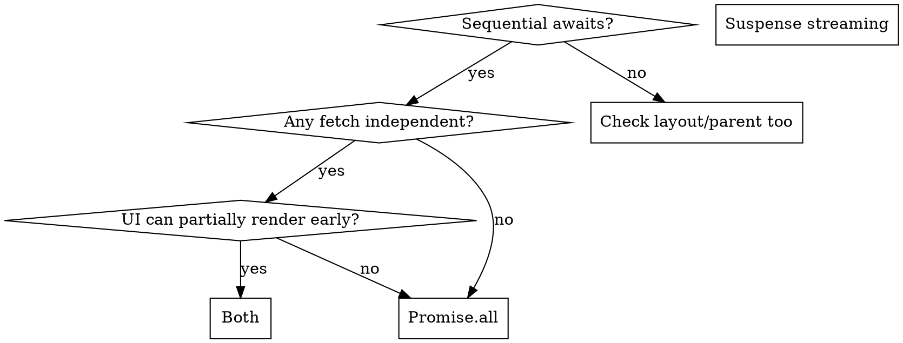

# Waterfall Killer

## Overview

Sequential server-side awaits are almost always the root cause of slow Next.js pages. `Promise.all` eliminates the waterfall but still blocks the response until the slowest fetch resolves. Suspense streaming lets the browser paint content as each chunk arrives. Run the diagnostic before proposing any solution.

## Diagnostic Protocol (Run This First)

Before suggesting a cache, a CDN, or any other fix:

```
1. Scan every `await` in the file — page, layout, and any parent segments
2. Map the dependency graph: which fetches truly depend on prior results?
3. Check: can ANY part of the UI render before ALL data resolves?
4. Then pick the right fix:
```



## Fix 1: Promise.all (Parallel Fetching)

Use when independent fetches run sequentially but the page can't render until all data is ready.

```tsx
// Before: sequential — 4 × 300ms = 1200ms
const user = await fetchUser()
const orders = await fetchOrders(user.id)
const recs = await fetchRecommendations(user.id)
const notifs = await fetchNotifications(user.id)

// After: parallel — 300ms + max(300, 300, 300) = 600ms
const user = await fetchUser()
const [orders, recs, notifs] = await Promise.all([
  fetchOrders(user.id),
  fetchRecommendations(user.id),
  fetchNotifications(user.id),
])
```

**Promise.all is not the final answer when FCP is the complaint.** It reduces total server time but the browser still waits for the slowest fetch.

## Fix 2: Suspense Streaming (Component-Level)

Use when some UI can render before all data resolves — almost always the right answer alongside Fix 1.

```tsx
// page.tsx — kick off all fetches, don't await them at page level
export default function FeedPage() {
  const postsPromise    = fetchPosts()      // 300ms
  const trendingPromise = fetchTrending()   // 800ms — sidebar, non-critical

  return (
    <div className="grid grid-cols-3">
      <main>
        <Suspense fallback={<PostsSkeleton />}>
          <PostFeed postsPromise={postsPromise} />
        </Suspense>
      </main>
      <aside>
        <Suspense fallback={<TrendingSkeleton />}>
          <TrendingWidget trendingPromise={trendingPromise} />
        </Suspense>
      </aside>
    </div>
  )
}

// PostFeed.tsx — async Server Component awaits inside the boundary
async function PostFeed({ postsPromise }: { postsPromise: Promise<Post[]> }) {
  const posts = await postsPromise
  return <ul>{posts.map(p => <PostCard key={p.id} post={p} />)}</ul>
}
```

**Timeline shift:**
- Before: browser waits 800ms (slowest), then paints everything
- After: browser paints posts at 300ms, sidebar streams in at 800ms

## Fix 3: Layout Waterfall

Layouts block every child route. Check them too.

```tsx
// Bad: two sequential DB calls on every page render
const settings = await fetchSettings()
const theme = await fetchTheme(settings.userId)

// Fix: userId should come from session/JWT, not a DB round-trip
const userId = await getSessionUserId()  // from cookie/JWT — fast
const theme = await fetchTheme(userId)
```

## Quick Reference

| Symptom | Fix |
|---------|-----|
| Sequential awaits, no FCP complaint | Promise.all |
| FCP slow, Promise.all already in use | Suspense streaming |
| Whole page delayed by one slow widget | Suspense around that widget |
| Layout slow on every page | Check layout for sequential awaits |
| "Cache will fix it" | Cache + waterfall = cached waterfall. Fix architecture first. |

## Common Mistakes

**Stopping at Promise.all.** It parallelizes fetches but the response still blocks on the slowest one. Always ask: can the user see anything before all data resolves?

**Accepting "don't restructure."** Adding Suspense boundaries is not a structural change to business logic — it's the correct data-fetching architecture. Push back: *"Wrapping this widget in Suspense gives users content 500ms sooner. It's a 5-line change to the JSX, not an architectural overhaul."*

**`loading.tsx` instead of component Suspense.** `loading.tsx` is a page-level fallback for navigation — it doesn't stream server-rendered content. Component-level `<Suspense>` does.

**Treating cache as the first fix.** `unstable_cache` or Redis on top of a waterfall just makes a cached waterfall. Fix the fetch graph first, cache second.

## Rationalization Table

| What Claude says | Reality |
|---|---|
| "Promise.all is already parallel, so that's fixed" | Parallel ≠ streaming. User still waits for the slowest. |
| "Don't restructure — just optimize" | Suspense is optimization. It's 5 lines of JSX, not a rewrite. |
| "A loading.tsx will handle the blank page" | Page-level skeleton, not streaming. FCP stays the same for SSR. |
| "Let's add Redis/cache first" | Cache × waterfall = cached waterfall. Fix the graph first. |
| "This fetch truly depends on the previous one" | Does it? Check if the dependency (userId, etc.) can come from session/JWT. |

## Red Flags — Stop and Re-Diagnose

- Proposing a solution before mapping the full await chain
- Suggesting cache before auditing fetch parallelism
- Adding `loading.tsx` and calling FCP fixed
- Accepting "don't restructure" without pushing back on Suspense
- Leaving any `await` outside a Suspense boundary when its UI is non-critical
