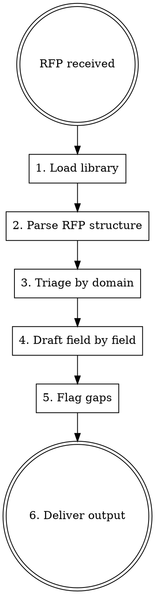

# RFP Response Builder

## Overview

Match every field in an RFP or vendor questionnaire to the company's pre-loaded documentation library, then draft accurate, defensible responses. Never invent capabilities. Every answer traces back to a source document.

## Process

## Step 1 — Load the Library

Search for documentation in this order. Stop at the first match:
1. Path explicitly provided by the user
2. `./docs/`, `./documentation/`, `./company-info/`, `./rfp-library/`
3. Any folder the user previously pointed to in this session

Read all files in the library directory. Index by domain:

| Domain | Typical keywords |
|--------|-----------------|
| Security | encryption, access control, SOC2, ISO27001, pen test, MFA, RBAC |
| Architecture | infrastructure, hosting, uptime, SLA, redundancy, cloud, DR/BCP |
| Compliance | GDPR, HIPAA, CCPA, audit, data residency, retention |
| Features | product capabilities, integrations, APIs, roadmap |
| Legal / Commercial | contract, indemnity, liability, insurance, SLA |

If no library is found, ask: *"Where is your documentation library? (folder path, Google Drive link, or paste the key docs here)"*

## Step 2 — Parse the RFP Structure

Identify:
- **Sections** (headers / tabs / categories)
- **Question/field list** (numbered or labeled)
- **Field type** per item: free text, yes/no, multi-select, numeric, upload
- **Character or word limits** (capture these — enforce them in drafts)
- **Mandatory vs. optional** fields

If the RFP is a PDF or image, extract all fields verbatim before drafting anything.

## Step 3 — Triage by Domain

Group fields into the domain buckets above. This drives which library documents to pull for each batch.

## Step 4 — Draft Field by Field

For each field:
1. Pull the most relevant passage(s) from the library
2. Write a response scoped to the field's character limit
3. Use professional, third-person declarative tone ("The platform encrypts data at rest using AES-256…")
4. Never hedge with "we believe" or "typically" — if the doc says it, state it; if it doesn't, flag it

**Tone rules:**
- Security/compliance: precise, cite standards by name (SOC 2 Type II, ISO 27001)
- Features: benefit-first, avoid jargon
- Architecture: specific (99.9% uptime, multi-region, daily backups — exact figures from docs only)

## Step 5 — Flag Gaps

Collect every field that could not be answered from the library:

| # | Question | Missing Information Needed |
|---|----------|---------------------------|
| 7 | Do you hold Cyber Liability insurance? | Policy details not in library |
| 23 | Describe your data residency options | Library silent on regions |

Present this list clearly so the user knows exactly what to fill in manually.

## Step 6 — Deliver Output

Format: one table per RFP section.

| # | Question (verbatim) | Draft Response | Source Doc | Confidence |
|---|---------------------|---------------|------------|-----------|
| 1 | … | … | security-overview.pdf §3 | High |
| 7 | … | [NEEDS HUMAN INPUT — see gaps] | — | — |

**Confidence levels:**
- **High** — exact language from library
- **Medium** — inferred from related documentation; user should verify
- **Low / Gap** — no library coverage; needs manual input

After the table, append the gaps list and ask the user to supply missing information before final review.

## Common Mistakes

| Mistake | Fix |
|---------|-----|
| Drafting from memory, not the library | Read the library first. Every claim needs a source. |
| Ignoring character limits | Capture limits in Step 2; trim to fit before outputting |
| Answering yes/no fields with prose | Match the field type exactly |
| Combining all sections into one wall of text | One table per section; reviewable row by row |
| Marking something "High" confidence when paraphrased | Paraphrase = Medium at best |
