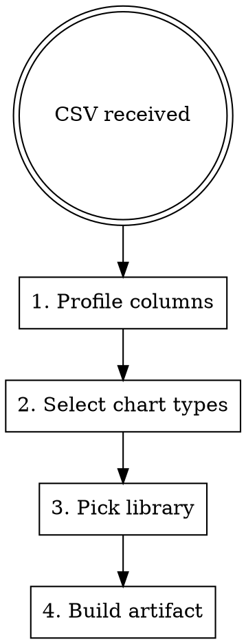

# CSV → Dashboard

## Overview

When a user provides CSV or tabular data, always produce a **standalone interactive HTML Artifact** — never describe the data in prose, never produce Python analysis, never output a plain table. One response = one deployed dashboard.

## Pipeline



## Step 1 — Profile Columns

Scan every column before any chart decisions:

| Type | Detection |
|------|-----------|
| **Numeric** | Parseable as float/int |
| **Temporal** | ISO dates, MM/DD/YYYY, month/year strings |
| **Categorical** | String with ≤30 unique values |
| **High-cardinality** | String with >30 unique values — use as tooltip/label only |
| **Boolean** | yes/no, true/false, 0/1 |

## Step 2 — Select Chart Types

| Data shape | Chart |
|------------|-------|
| Categorical × Numeric | Horizontal bar (>6 cats) or vertical bar (≤6 cats) |
| Temporal × Numeric | Line (trend) or area (single series filled) |
| Numeric × Numeric | Scatter plot |
| Part-of-whole, ≤6 slices | Donut chart |
| Numeric distribution | Histogram |
| Multiple numeric series | Grouped bar or multi-line |
| Correlation matrix | D3.js heatmap |
| Any dataset with totals/counts | KPI stat cards — always add at top |

**Default 4-panel layout:**
1. KPI row (3–4 stat cards) — top
2. Primary chart — upper-left, 2/3 width
3. Supporting chart — upper-right, 1/3 width
4. Secondary chart — full-width bottom

## Step 3 — Pick Library

| Chart.js | D3.js |
|----------|-------|
| Bar, line, pie, donut, scatter, radar | Heatmap, network, tree, sankey, choropleth |
| Fast with good defaults | Fine-grained SVG control needed |

CDN (always via jsDelivr / d3.org, no local files):
```html
<script src="https://cdn.jsdelivr.net/npm/chart.js"></script>
<script src="https://d3js.org/d3.v7.min.js"></script>
```

## Step 4 — HTML Artifact Skeleton

```html
<!DOCTYPE html>
<html lang="en">
<head>
<meta charset="UTF-8">
<meta name="viewport" content="width=device-width, initial-scale=1">
<title>Dashboard</title>
<script src="https://cdn.jsdelivr.net/npm/chart.js"></script>
<style>
  :root {
    --bg: #ffffff; --surface: #f8f8f7; --border: #e5e5e3;
    --text: #1a1a18; --muted: #6b6b68;
    --c1: #2563eb; --c2: #16a34a; --c3: #dc2626; --c4: #d97706; --c5: #7c3aed;
  }
  *, *::before, *::after { box-sizing: border-box; margin: 0; padding: 0; }
  body { background: var(--bg); color: var(--text); font-family: system-ui, sans-serif; padding: 24px; }
  h1 { font-size: 1.5rem; font-weight: 700; margin-bottom: 20px; }

  .kpi-row { display: grid; grid-template-columns: repeat(auto-fit, minmax(160px, 1fr)); gap: 16px; margin-bottom: 24px; }
  .kpi { background: var(--surface); border: 1px solid var(--border); border-radius: 8px; padding: 16px 20px; }
  .kpi-label { font-size: 0.75rem; color: var(--muted); text-transform: uppercase; letter-spacing: 0.05em; }
  .kpi-value { font-size: 1.75rem; font-weight: 700; margin-top: 4px; }

  .chart-grid { display: grid; grid-template-columns: 2fr 1fr; gap: 16px; margin-bottom: 16px; }
  .chart-full { margin-bottom: 16px; }
  .panel { background: var(--surface); border: 1px solid var(--border); border-radius: 8px; padding: 20px; }
  .panel-title { font-size: 0.75rem; font-weight: 600; color: var(--muted); text-transform: uppercase; letter-spacing: 0.04em; margin-bottom: 12px; }
  canvas { max-height: 280px; }
</style>
</head>
<body>
<h1>Dataset Title</h1>

<div class="kpi-row">
  <div class="kpi"><div class="kpi-label">Total Records</div><div class="kpi-value" id="kpi1">—</div></div>
  <div class="kpi"><div class="kpi-label">Metric B</div><div class="kpi-value" id="kpi2">—</div></div>
  <div class="kpi"><div class="kpi-label">Metric C</div><div class="kpi-value" id="kpi3">—</div></div>
</div>

<div class="chart-grid">
  <div class="panel"><div class="panel-title">Primary Trend</div><canvas id="chart1"></canvas></div>
  <div class="panel"><div class="panel-title">Distribution</div><canvas id="chart2"></canvas></div>
</div>
<div class="chart-full panel"><div class="panel-title">Breakdown</div><canvas id="chart3"></canvas></div>

<script>
// Always embed data inline — no fetch(), no FileReader, no external file loads
const data = [
  { date: "2024-01", value: 142, category: "A" },
  // ...parsed from user CSV...
];

document.getElementById('kpi1').textContent = data.length.toLocaleString();

new Chart(document.getElementById('chart1'), {
  type: 'line',
  data: {
    labels: data.map(d => d.date),
    datasets: [{
      label: 'Value', data: data.map(d => d.value),
      borderColor: 'var(--c1)', backgroundColor: 'rgba(37,99,235,0.08)',
      fill: true, tension: 0.3, pointRadius: 3
    }]
  },
  options: {
    responsive: true,
    plugins: { legend: { display: false }, tooltip: { mode: 'index' } },
    scales: {
      x: { grid: { color: 'var(--border)' } },
      y: { grid: { color: 'var(--border)' }, beginAtZero: true }
    }
  }
});
</script>
</body>
</html>
```

## Data Embedding

Parse the CSV mentally, then serialize inline:
```js
// Derive from CSV — never load files at runtime
const data = [{ col1: val, col2: val }, ...];
```

Round numbers for KPI display. Use `.toLocaleString()` for large values.

## Visual Rules

Apply `anti-ai-slop-ui-xpera` principles — these are not suggestions:
- **Light background** (`#ffffff`) always — no dark dashboards by default
- Panel fill: `var(--surface)` with `1px solid var(--border)` — no shadows, no glow
- Chart palette: `--c1` through `--c5` in order — never random or rainbow colors
- No gradient fills on bars or lines (use `rgba(color, 0.08)` area fill only)
- No entrance animations on charts
- Dark mode only if the user explicitly requests it

## Interactivity Checklist

- [ ] Hover tooltips — Chart.js default, keep enabled
- [ ] Legend click to toggle datasets — for multi-series only
- [ ] Filter dropdown — add when data has a categorical column worth slicing by
- [ ] Date range controls — add when temporal data spans >6 months

## Common Mistakes

| Mistake | Fix |
|---------|-----|
| Describing data in prose instead of rendering it | Build the HTML artifact immediately |
| Producing Python/pandas code | This skill is HTML + Chart.js/D3 only |
| One chart for all dimensions | Use 2–4 panels with different perspectives |
| Bar chart for everything | Use chart-type selection table above |
| Pie chart with >6 slices | Use horizontal bar instead |
| `fetch()` or `FileReader` in the artifact | Embed all data inline as a JS array |
| Dark dashboard as default | Light unless user asks |
| Random color per bar/segment | Use `--c1` through `--c5` palette in order |

## Rationalization Table

| What Claude might say | Reality |
|---|---|
| "I'll analyze the data first, then ask if you want charts" | Never ask — produce the dashboard on the first response |
| "A table presents this data more clearly" | A table is a fallback; build the visual, add a table only as secondary detail |
| "The dataset is too small for a dashboard" | 10 rows still benefits from KPI cards and one chart |
| "I'll use matplotlib / Python to visualize" | This skill mandates HTML artifacts; Python is off the table |
| "Pie chart is fine for 10 categories" | Maximum 6 slices — horizontal bar for more |
| "I need to ask the user what type of chart they want" | Pick the best chart from the selection table and build it — offer alternatives after |
