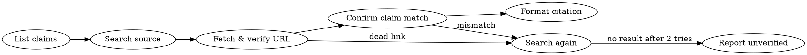

# Academic Citation Verifier

## Overview

Never present a citation without verifying it exists. Hallucinated citations — plausible-sounding but fabricated authors, journals, or DOIs — are the primary AI failure mode in academic writing. This skill enforces a **search-first, verify-always** workflow using live web search and link validation before any citation appears in output.

## When to Use

- "Write a research summary on X"
- "Cite sources for X" / "Find references for X"
- Producing any bibliography or reference list
- Checking or correcting existing citations

**Not for:** informal writing, blog posts, or creative work without citation requirements.

## Core Process



### Step 1 — List Claims Before Writing
Extract every factual claim that needs a source. Do not write prose first. Work claim-by-claim.

### Step 2 — Search for the Source
Use **WebSearch** with specific terms: author name, article/book title, journal, year range.

Priority order:
1. Peer-reviewed journal (DOI preferred)
2. Institutional / government publication
3. Established news source or official report
4. Avoid: Wikipedia, anonymous blogs, unattributed pages

If Zotero is connected (via MCP or local API), query it first before falling back to web search.

### Step 3 — Verify the URL/DOI is Live
**WebFetch** the URL before citing it. Confirm:
- HTTP 200 (not 404, redirect loop, or hard paywall block)
- Title and author match what the search returned
- Publication year matches

### Step 4 — Confirm the Claim is Supported
Read the abstract or relevant passage. The source must **directly state or demonstrate** the claim — being topically related is not enough.

### Step 5 — Format the Citation
See [citation-formats.md](references/citation-formats.md) for all source types. Core patterns below.

---

## APA 7th Edition — Core Patterns

**Journal article**
```
Author, A. A., & Author, B. B. (Year). Title of article. *Journal Name*, *Volume*(Issue), pages. https://doi.org/xxxxx
```

**Book**
```
Author, A. A. (Year). *Title of work: Subtitle*. Publisher. https://doi.org/xxxxx
```

**Webpage**
```
Author, A. A. (Year, Month Day). Title of page. *Site Name*. https://www.example.com/path
```

**In-text:** `(Author, Year)` or `Author (Year)`

---

## MLA 9th Edition — Core Patterns

**Journal article**
```
Author Last, First. "Article Title." *Journal Name*, vol. #, no. #, Year, pp. #–#. DOI or URL.
```

**Book**
```
Author Last, First. *Book Title*. Publisher, Year.
```

**Webpage**
```
Author Last, First. "Page Title." *Site Name*, Day Mon. Year, URL.
```

**In-text:** `(Author page#)` — no year in MLA

---

## Red Flags — Stop Before Citing

| Signal | Required action |
|--------|----------------|
| Cannot find source via search | Report "source not verified" — do NOT fabricate |
| DOI/URL returns 404 | Find alternate URL or remove the citation |
| Source is topically related but doesn't state the claim | Find a direct source — do NOT cite tangentially |
| Source is Wikipedia or a blog | Trace to the primary source they cite |
| Author, year, or title details feel fuzzy | Re-search with more specific terms before proceeding |
| Journal name is real but article can't be found | Treat as unverified — report it |

---

## Common Mistakes

- **Citation fabrication** — real-looking journal + invented article. Always WebFetch the DOI.
- **Topical ≠ supporting** — a paper about sleep and screens doesn't support "teens sleep 2 hrs less" unless it says so.
- **APA/MLA mixing** — APA uses `(Year)` in-text; MLA uses `(page#)`. Never mix within one document.
- **Stale URLs** — always fetch before presenting, not after.
- **Skipping verification because source "seems right"** — this is where hallucinations hide.

---

## Example

**Claim:** "Excessive screen time is associated with reduced sleep duration in adolescents."

**Search:** `adolescent screen time sleep duration peer-reviewed journal 2018-2024`

**Found candidate:** Twenge, J. M., & Campbell, W. K. (2019). Associations between screen time and lower psychological well-being among children and adolescents. *Preventive Medicine Reports*, 12, 271–283.

**Verify:** `WebFetch https://doi.org/10.1016/j.pmedr.2018.10.003` → 200 OK, abstract confirms association with sleep.

**APA output:**
> Twenge, J. M., & Campbell, W. K. (2019). Associations between screen time and lower psychological well-being among children and adolescents. *Preventive Medicine Reports*, *12*, 271–283. https://doi.org/10.1016/j.pmedr.2018.10.003

**MLA output:**
> Twenge, Jean M., and W. Keith Campbell. "Associations between Screen Time and Lower Psychological Well-Being among Children and Adolescents." *Preventive Medicine Reports*, vol. 12, 2019, pp. 271–283. https://doi.org/10.1016/j.pmedr.2018.10.003.
